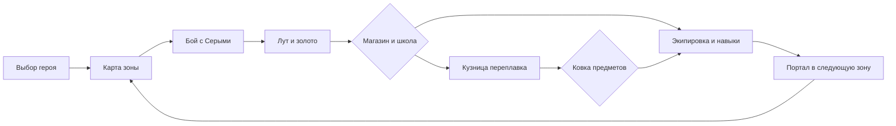
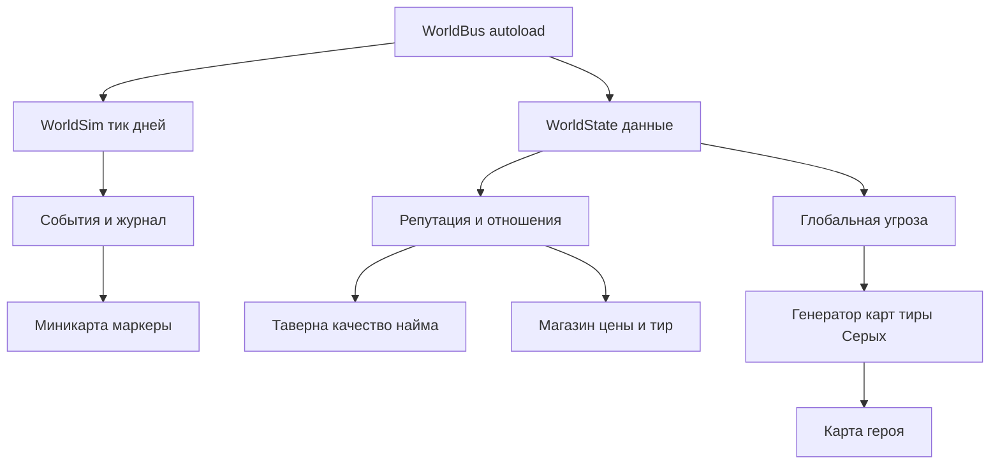

# Видение: что нужно, чтобы «Allods Home» стала идеальной игрой своего класса

> Документ: `Allodshome/docs/audit/03-vision.md`
> Класс игры: **изометрическая тактическая RPG-песочница** («духовный наследник Аллодов II», без кампании).
> Базис: текущее состояние (см. [`01-audit-report.md`](01-audit-report.md)), дорожные карты [`AGENTS.md §13`](../../AGENTS.md:982) и [`docs/mechanics-roadmap.md`](../../docs/mechanics-roadmap.md).

---

## 1. Что значит «идеальная в своём классе»

Для тактической песочницы-наследника Аллодов идеал складывается из трёх опор, а не одной фичи:

1. **Затягивающее ядро-цикл**: «вышел из города → убил → подобрал лут → продал/переплавил → потратил золото на прокачку и экипировку → стал сильнее → ушёл в следующую зону». Цикл должен работать без единого разрыва и **без «дыр» в экономике**.
2. **Живой мир за пределами карты героя**: SIM-слой, который *виден и влияет* на игрока (фракции воюют, города живут, репутация открывает двери, мир давит угрозой), а не тикает вхолостую.
3. **Глубина и отдача** (game-feel): бой с ощутимым импактом, интересный AI отряда, богатые механики (магия, кузня, алхимия, некромантия), атмосфера (день/ночь, музыка, звук) и полировка до 60 FPS на 1280×800.

Ниже — gap-анализ по этим опорам и план их закрытия.

---

## 2. Опорный core-loop: где сейчас дыры

**Текущее состояние цикла:**

| Звено цикла | Статус | Дыра |
|---|---|---|
| Выбор героя | ✅ Готов | Есть редактор атрибутов и склонность; нет выбора стартовой зоны (всегда `mid`) |
| Карта зоны | ✅ Готов | Одна карта 128×128; зоны не соединены (портал-заглушка) |
| Бой с Серыми | ✅ Готов | Нет тиров/элит/боссов (пакет C из AGENTS §13); нет тумана войны |
| Лут | 🟡 Частично | Мешок-код без спрайта; `loot_icons/` не используется; дроп перебирает всю БД |
| Магазин/школа | ✅ Готов | — |
| Кузница | 🟡 Полу-готово | **Переплавка в никуда**: слитки не используются, ковки нет |
| Портал в зону | 🔴 Заглушка | Телепорт на спавн |
| Экономика SIM | 🔴 Не связана | Репутация/фракции не влияют на цены, наёмников, города |

**Вывод:** фундамент цикла построен, но три звена — «портал», «кузница→ковка», «зона→прогрессия» — либо заглушки, либо отсутствуют. Именно их закрытие превращает песочницу из «погулять по одной карте» в «играть в мир».

---

## 3. Pillar 2 — Живой мир: SIM, который виден

### 3.1 Текущее состояние
SIM-слой ([`world_state.gd`](../../scripts/world/world_state.gd), [`world_sim.gd`](../../scripts/world/world_sim.gd)) — чистый, headless, сериализуемый. Но:
- `reseed()` кладёт хардкод-фикстуру (2 фракции, 2 юнита);
- рассинхрон данных (армии без `power`, экономика не читается) — см. R-P0-3;
- **ноль точек связи с игрой**: репутация не влияет на магазин/таверну, события SIM не показываются, день не двигается вместе с игрой.

### 3.2 Что нужно (минимально достаточный набор для «живого мира»)
1. **Связка времени**: день мира растёт вместе с игровым временем (например, 1 игровой день = N минут реальных), SIM тикает только когда игрок в мире, состояние — в автосейве.
2. **Видимость SIM**: миникарта получает «!»-маркеры событий (армия идёт к городу, бунт, караван) — первый видимый результат SIM.
3. **Репутация → экономика**: у города в SIM есть `loyalty`/отношения; при плохих отношениях магазин дороже, таверна предлагает худших наёмников, стражи агрессивны (переход к войне). Это замыкает SIM на core-loop.
4. **Угроза как двигатель**: рост `global_threat` усиливает Серых на карте героя (тиры/элиты по мере роста угрозы) — «мир давит» без «конца света».
5. **Фракционные войны**: армии фракций двигаются по регионам; если война дошла до города игрока — он видит последствия (разрушенные здания, лагеря, осада).

### 3.3 Целевая архитектура связки

---

## 4. Pillar 3 — Глубина, отдача и полировка

### 4.1 Системы глубины (по механик-роадмапу)

| Система | Статус | Что закрыть | Скилл-домен |
|---|---|---|---|
| Магия 31 заклинание | ✅ Готов | Крит (поля в БД уже есть), автокаст, шорткаты F4–F12 | `rpg`, `godot-gdscript` |
| Стойки и формации отряда | 🟡 Частично | Defend/Swarm/Retreat/Stand Ground; формации; группы 1–9 | `game-ai`, `input-systems` |
| Кузница → ковка | 🔴 Нет | Слиток + рецепт → предмет (кованые тиры), качество по навыку | `rpg`, `survival-crafting` |
| Алхимия | 🟡 Минимум | 2 рецепта → 8+ эффектов зелий, травы как ресурс | `rpg`, `survival-crafting` |
| Тиры Серых + элиты + боссы | 🔴 Нет (пакет C) | Уровни 1–5, элиты ×1.5 HP, именные боссы на зону | `procedural-gen`, `rpg` |
| Контракты/квесты в таверне | 🔴 Нет | Генератор контрактов из quest.txt, журнал клавишей W | `dialogue-systems`, `rpg` |
| Диалоги НПЦ | 🔴 Нет | Окно диалога с ветками по полу/классу | `dialogue-systems` |
| День/ночь | 🔴 Нет | Цикл освещения от `time_of_day` из .alm, ночные мобы | `godot-2d-rendering` |
| Некромантия | 🟡 Задел есть | Animate_Dead работает; нужны контракты «приведи N зомби» | `rpg` |
| Туман войны | 🔴 Нет | FOV по обзору героя/отряда, «!»-маркеры | `roguelike`, `procedural-gen` |

### 4.2 Отдача и полировка (game-feel, где инди-игры «проигрывают»)

1. **Импакт боя**: hit-stop (заморозка 30–60 мс на попадание), микро-тряска при убийстве, вспышка урона — базовый набор уже есть (screen shake, damage numbers), добавить hit-stop и звуковые варианты ударов.
2. **Аудио**: адаптивная музыка (боевая/городская/ночная темы) через `AudioStreamPlayer` + bus-ы; вариации SFX (высота тона случайная), ducking при диалогах.
3. **AI отряда**: Utility-AI-скоринг для наёмника (атаковать/лечиться/отступить) вместо «ближайший враг» — скилл `ai-behavior-trees-utility-ai`.
4. **Камера**: зум колесом, плавный follow с lookahead, вспышка-экран на большие события (осада, босс).
5. **Визуальный язык**: у зон/уровней опасности — единые телеграфы (уже сделаны по `2d-ground-effects`), распространить на все AoE.
6. **Туман войны** + освещение свечей/костров ночью (Light2D уже есть — подружить с циклом дня).

### 4.3 Инженерная готовность

| Аспект | Статус | Цель |
|---|---|---|
| Производительность | 🟡 O(N²) на юнитах, BFS pop_front | 60 FPS при 100+ юнитах; кэши; A* с кучей |
| Сохранения | ✅ Отлично | Позиция героя (R-P0-4), hotbar (R-P1-9), мерки/партия в v2 |
| Ввод | 🟡 Raw keycodes | Input Map + ремаппинг в настройках |
| Настройки | 🔴 Нет | Громкость, ремаппинг, разрешение, язык |
| Локализация | 🟡 ru только | Словари локализации (перевод имён предметов уже есть) |
| CI/автоматизация | 🟡 Ручные прогоны | Скрипт `run_all_smoke.bat/.ps1`: парсинг + все smoke + SIM |
| Экспорт | 🔴 Нет presets | Windows/Linux presets, тест экспортированной сборки |
| Документация | 🟡 Устарела | README/HOW_TO_RUN актуализировать (R-P2-8) |

---

## 5. Критерии «идеальности» — чеклист цели

К моменту «v1.0 в классе» должны выполняться **все** пункты:

- [ ] Core-loop замкнут: бой → лут → экономика → прокачка → **следующая зона** (портал работает).
- [ ] Кузница даёт **ковку** (слиток не конечный продукт), алхимия — 8+ зелий.
- [ ] SIM виден игроку: «!»-маркеры, репутация влияет на цены/найм, угроза двигает тиры Серых.
- [ ] Тиры/элиты/боссы работают (пакет C).
- [ ] Контракты в таверне + журнал (W) — минимальный «сюжет» песочницы.
- [ ] День/ночь с освещением и ночными мобами.
- [ ] Туман войны на карте героя.
- [ ] Отряд: стойки/команды работают для наёмников, формации необязательны в v1.
- [ ] Input Map + экран настроек (громкость, ремаппинг).
- [ ] 60 FPS при 100+ юнитах на 128×128; парсинг и все smoke-тесты зелёные.
- [ ] Экспортируемая сборка Windows запускается из коробки; автосейв на выходе работает.
- [ ] Документация (README/HOW_TO_RUN/AGENTS журнал) актуальна.

---

## 6. Предлагаемый порядок работ (фазы)

> Учитывает зависимость: сначала чиним каркас (P0), потом наполняем системы.

1. **Фаза 0 — «Каркас без заглушек»** (R-P0-1…6): debug_magic, портал+зоны, контракт SIM, позиция в save, damage_area, project.godot. После фазы 0 игра «честная»: что заявлено — работает.
2. **Фаза 1 — «Глубже в цикл»** (R-P1 + vision 4.1 верх): ковка, тиры Серых (пакет C), зелья из данных, команды отряда, hotbar. Core-loop полностью замкнут.
3. **Фаза 2 — «Живой мир»** (vision §3): связка времени, репутация→экономика, «!»-маркеры, угроза→тиры, фракционные войны в SIM.
4. **Фаза 3 — «Полировка и глубина»** (vision §4): контракты, диалоги, день/ночь, туман войны, аудио/музыка, hit-stop, настройки/ремаппинг, локализация, CI, экспорт.
5. **Фаза 4 — «Оптимизация и качество»**: перф-бюджеты, A* с кучей, миникарта-слои, тесты производительности, бета-прогоны на слабых машинах.

**Правило по ходу:** каждый пункт — отдельная задача по AGENTS §9.1, с тестами из §3 и ручной проверкой игрока.

---

## 7. Чего сознательно НЕ делаем (чтобы не размыть класс)

- Кампания/миссии/катсцены (решение из [`docs/mechanics-roadmap.md`](../../docs/mechanics-roadmap.md:115)).
- Мультиплеер, онлайн-экономика.
- Полная копия баланса/переполнений оригинала (уже отклонено 25.09).
- Мета-прогрессия вне мира (батлпассы, ежедневки).

---

*Этот документ — целевое видение, а не план работ на завтра; конкретные задачи и проверки — в [`02-recommendations.md`](02-recommendations.md).*